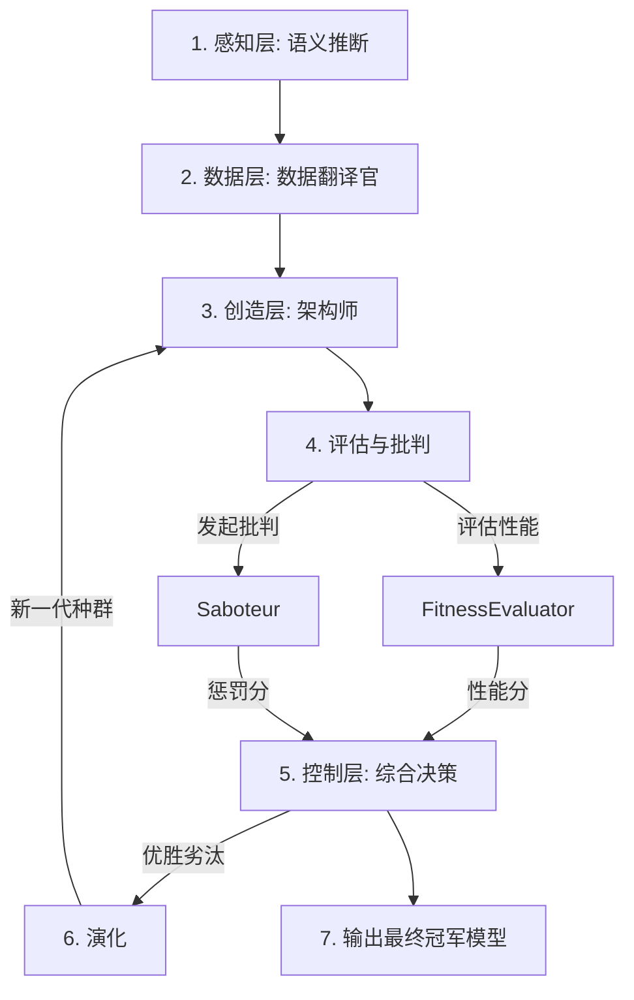

# 对抗性共演化系统 - V1.0

## 📋 项目概述

传统的机器学习建模是一个高度依赖专家经验的劳动密集型过程，涉及复杂的数据预处理、特征工程、模型选择和验证。本项目的核心目标是**将这一过程完全自动化**。

我们构建的不是一个单一的AutoML工具，而是一个模拟的**“AI智能体社会”**。在这个社会中，不同的AI智能体基于**遗传算法**进行协作与竞争，通过一种名为**“对抗性共演化”**的机制，自动探索、优化并验证端到端的机器学习建模策略。

系统的最终目标是发现并输出一个不仅在**性能指标（如AUC）**上表现优异，同时在**经济成本、逻辑合理性（因果关系）和泛化能力**等多个维度都经得起考验的、稳健的、可用于生产环境的机器学习模型。

---

## 🧠 设计理念与核心思路

我们认为，一个优秀的自动化建模系统不仅要能“建设”，还要能“批判”。单一的优化目标（如准确率）往往会导致模型在真实世界中表现不佳。因此，我们引入了两个核心角色：**架构师（Architect）**和**破坏者（Saboteur）**。

### 1. “架构师” (The Creator)
- **角色**：一个富有创造力的AI工程师。
- **目标**：构建性能最强的机器学习模型。
- **行为**：它通过遗传算法的“繁殖”与“变异”，不断尝试新的特征组合、数据变换和模型算法，探索所有可能的建模路径，这类似于一个数据科学家在尝试不同的建模假设。

### 2. “破坏者” (The Critic)
- **角色**：一个充满怀疑精神的AI评审员。
- **目标**：从多个维度挑战“架构师”创建的模型，找出其弱点。
- **行为**：它会提出一系列尖锐的批判性问题：
  - **经济学批判**：“这个模型的特征太多，计算时间太长，在生产环境中运行的成本是否过高？”
  - **因果批判**：“模型的高性能是否仅仅因为它学到了一些虚假的关联？（例如，从邮政编码预测信用风险）是否存在潜在的数据偏见或歧视风险？”
  - **（未来）泛化批判**：“这个模型在训练集上表现很好，但它能否很好地适应从未见过的新数据或边缘案例？”

### 3. “对抗性共演化” (Adversarial Co-evolution)
这是整个系统的核心驱动力。
- “架构师”的目标是创造出不仅性能高，而且能**经受住“破坏者”所有批判**的稳健模型。
- “破坏者”则在批判的过程中，不断**提升自己发现模型深层缺陷的能力**。
- 这种持续的“军备竞赛”迫使整个系统向着一个**多目标、更全局最优**的方向进化，最终产出的模型不再是“偏科生”，而是全面发展的“优等生”。

---

## ⚙️ 系统工作流程

系统通过一系列精心设计的模块，将原始数据逐步转化为一个经过充分验证的、高质量的机器学习模型。



1.  **感知 (`semantic_inference.py`)**：系统首先扫描原始、混乱的数据库（例如，表名为 `tbl_log_05`，列名为 `val_01`），并借助LLM的理解能力，推断出其背后的业务含义，形成一个干净、标准的“业务模式”（例如，`UserTransaction.TransactionAmount`）。
2.  **翻译 (`data_translator.py`)**：`数据翻译官`作为一个适配器，它隐藏了所有底层数据的复杂性，为上层AI智能体提供一个统一、标准的数据访问接口（`KnowledgeGraphInterface`）。从此，所有模块都只与标准业务概念打交道。
3.  **创生与演化 (`architect.py`)**：
    - `GeneGenerator`：调用LLM进行头脑风暴，产生初始的建模“基因”（例如，`对交易额取30天平均值`）。
    - `EvolutionaryEngine`：将这些基因组合成“染色体”（`ModelingChromosome`），每一条染色体就是一个完整的、端到端的建模流程。并通过遗传算法（选择、交叉、变异）管理种群的演化。
4.  **执行与评估 (`architect.py`)**：
    - `FeatureEngine`：解析染色体中的特征基因，执行特征工程，生成可用于训练的特征矩阵。
    - `FitnessEvaluator`：使用生成的特征矩阵，真实地训练和评估模型，得出其性能分数（如AUC）。
5.  **批判 (`saboteur.py`)**：在模型评估完成后，“破坏者”的各个“攻击模块”会立即对该建模策略进行多维度批判，并给出相应的“惩罚分数”。
6.  **综合决策与演化 (`main.py`)**：`控制单元`作为总指挥，它根据模型的**性能分**和来自破坏者的**惩罚分**，计算出一个最终的“综合适应度”。这个综合分数决定了哪些“染色体”能够在遗传算法中胜出，从而将它们的优秀基因传递给下一代。
7.  **循环与收敛**：以上过程循环往复，每一代都会产出比上一代更优秀的建模策略。最终，系统在指定的演化代数完成后，输出综合表现最佳的“冠军模型”。

---

## 🎯 核心特性

### 已实现功能
- ✅ **语义推断**：自动理解原始数据结构
- ✅ **数据翻译**：将物理表名映射到标准业务名称
- ✅ **特征工程**：支持跨表聚合（AVG、COUNT、SUM等）
- ✅ **模型训练**：使用sklearn进行真实的模型训练和评估
- ✅ **经济批判**：基于时间和特征数量的成本评估
- ✅ **因果批判**：通过LLM识别潜在的偏见和伪关联
- ✅ **遗传算法**：实现选择、交叉、变异操作
- ✅ **动态权重调整**：自动调整适应度函数权重

### 技术架构
- **感知层**：语义推断模块 (`semantic_inference.py`)
- **数据层**：数据翻译官 (`data_translator.py`)
- **创造层**：架构师模块 (`architect.py`)
- **批判层**：破坏者模块 (`saboteur.py`)
- **控制层**：控制单元 (`main.py`)

## 📁 项目结构

```
code/
├── core_structures.py              # 核心数据结构定义
├── knowledge_graph_interface.py    # 知识图谱接口（抽象基类）
├── llm_placeholders.py             # LLM占位符模块
├── semantic_inference.py           # 语义推断模块
├── data_translator.py              # 数据翻译官实现
├── architect.py                    # 架构师核心模块
├── saboteur.py                     # 破坏者批判模块
└── main.py                         # 控制单元主程序
```

## 🚀 快速开始

### 环境要求

- Python 3.7+
- 必需依赖：
  - pandas
  - numpy
  - scikit-learn

### 安装依赖

```bash
pip install pandas numpy scikit-learn
```

### 运行系统

#### 方法1：直接运行主程序

```bash
python main.py
```

这将运行完整的对抗性共演化系统：
- 20个世代
- 每代50个个体
- 每5个世代增加一次对抗压力

#### 方法2：自定义运行

```python
from main import ControlUnit

# 创建控制单元
control_unit = ControlUnit(target_variable="UserProfile.IsDefault")

# 运行共演化
control_unit.run(
    generations=10,          # 世代数
    population_size=30,      # 种群大小
    challenge_interval=3     # 权重更新间隔
)
```

### 测试单个模块

每个模块都可以独立测试：

```bash
# 测试核心数据结构
python core_structures.py

# 测试语义推断
python semantic_inference.py

# 测试数据翻译官
python data_translator.py

# 测试架构师
python architect.py

# 测试破坏者
python saboteur.py
```

## 📖 详细使用指南

### 1. 修改目标变量

在 `main.py` 中修改目标变量：

```python
TARGET_VARIABLE = "UserProfile.IsDefault"  # 修改为您的目标变量
```

### 2. 调整演化参数

在 `ControlUnit.run()` 方法中调整参数：

```python
control_unit.run(
    generations=20,          # 增加世代数以获得更好的结果
    population_size=50,     # 增加种群大小以增加多样性
    challenge_interval=5     # 调整对抗压力更新频率
)
```

### 3. 自定义基因池

修改 `llm_placeholders.py` 中的 `llm_generate_genes_mock()` 函数：

```python
gene_list_json = [
    {"op": "AVG", "path": "UserTransaction.TransactionAmount", "window": 30},
    # 添加您的自定义基因...
]
```

### 4. 调整成本预算

在 `saboteur.py` 中修改经济学攻击者的预算：

```python
class EconomicsAttacker(BaseAttacker):
    def __init__(self, translator, target_variable):
        super().__init__(translator, target_variable)
        self.time_budget_ms = 200.0  # 修改时间预算
        self.feature_budget = 4      # 修改特征数量预算
```

### 5. 自定义适应度函数权重

在 `main.py` 中修改权重：

```python
self.fitness_weights = {
    'auc': 1.0,              # AUC的权重
    'economics': -0.1,       # 经济惩罚权重
    'causal': -0.2,          # 因果惩罚权重
    'synthesis': -0.1        # 合成惩罚权重
}
```

## 🔧 模块说明

### core_structures.py
定义系统的核心数据结构：
- `ModelingGene`：抽象基类
- `FeatureGene`：特征基因
- `TransformGene`：变换基因
- `ModelGene`：模型基因
- `FilterGene`：过滤基因
- `ModelingChromosome`：建模策略染色体

### knowledge_graph_interface.py
定义数据访问接口：
- `KnowledgeGraphInterface`：抽象基类
- `get_standard_schema()`：获取标准模式
- `get_entity_dataframe()`：获取实体数据
- `get_relationship_keys()`：获取关系键

### llm_placeholders.py
LLM调用占位符：
- `llm_infer_schema_mock()`：语义推断
- `llm_generate_genes_mock()`：基因创生
- `llm_critique_causality_mock()`：因果批判

### semantic_inference.py
语义推断模块：
- `run_semantic_inference()`：主函数
- 自动扫描数据库结构
- 调用LLM推断业务语义

### data_translator.py
数据翻译官实现：
- `KnowledgeGraphTranslator`：翻译官类
- 创建内存数据库
- 实现数据访问接口

### architect.py
架构师核心模块：
- `GeneGenerator`：基因生成器
- `FeatureEngine`：特征工程引擎
- `FitnessEvaluator`：适应度评估器
- `EvolutionaryEngine`：演化引擎

### saboteur.py
破坏者批判模块：
- `EconomicsAttacker`：经济学攻击
- `CausalAttacker`：因果批判
- `SynthesisAttacker`：合成攻击（占位符）

### main.py
控制单元主程序：
- `ControlUnit`：控制单元类
- 组装所有模块
- 运行对抗性共演化循环

## ⚠️ 已知问题和待改进项

### 1. LLM占位符
**当前状态**：使用硬编码的模拟响应

**改进方案**：
- 实现真实的LLM API调用
- 使用OpenAI GPT、Claude等模型
- 添加prompt engineering和响应解析

**修改位置**：
- `llm_placeholders.py`
- `semantic_inference.py`
- `architect.py` (GeneGenerator)
- `saboteur.py` (CausalAttacker)

### 2. 数据来源
**当前状态**：使用内存中的模拟数据

**改进方案**：
- 连接到真实数据库（MySQL、PostgreSQL等）
- 实现数据连接和查询接口
- 添加数据缓存机制

**修改位置**：
- `data_translator.py`
- `_create_in_memory_database()` 方法

### 3. 特征工程时间窗口
**当前状态**：不支持真实的时间窗口过滤

**改进方案**：
- 实现基于时间窗口的聚合
- 添加时间切片功能
- 支持动态时间范围

**修改位置**：
- `architect.py` 中的 `FeatureEngine.build_features()` 方法
- 处理 `gene.window` 参数

### 4. 变换基因支持
**当前状态**：只支持基本的聚合操作

**改进方案**：
- 实现TransformGene的完整支持
- 添加对数变换、标准化等
- 实现TransformGene → FeatureEngine的集成

**修改位置**：
- `architect.py` 中的 `FeatureEngine.build_features()` 方法

### 5. 过滤基因支持
**当前状态**：只定义了FilterGene，未实现

**改进方案**：
- 实现FilterGene的解析和执行
- 支持WHERE条件过滤
- 集成到特征工程流程

**修改位置**：
- `architect.py` 中的 `FeatureEngine.build_features()` 方法

### 6. 更多模型算法
**当前状态**：只支持LogisticRegression

**改进方案**：
- 添加XGBoost、RandomForest等算法
- 支持超参数优化
- 实现模型选择策略

**修改位置**：
- `architect.py` 中的 `FitnessEvaluator.evaluate()` 方法
- `llm_placeholders.py` 中的基因创生

### 7. 交叉操作优化
**当前状态**：简单的单点交叉，可能出现重复

**改进方案**：
- 实现去重逻辑
- 添加基因唯一性检查
- 优化交叉策略

**修改位置**：
- `architect.py` 中的 `EvolutionaryEngine.crossover()` 方法

### 8. 输出结果保存
**当前状态**：只在控制台打印结果

**改进方案**：
- 保存最佳模型到文件
- 导出特征重要性
- 生成可视化报告

**修改位置**：
- `main.py` 中的 `ControlUnit.run()` 方法

### 9. 并行计算
**当前状态**：单线程顺序评估

**改进方案**：
- 使用multiprocessing并行评估个体
- 支持分布式演化
- 添加进度条

**修改位置**：
- `architect.py` 中的 `FitnessEvaluator`
- `main.py` 中的评估循环

### 10. 提前停止机制
**当前状态**：固定运行指定世代数

**改进方案**：
- 实现收敛检测
- 添加early stopping
- 监控性能提升

**修改位置**：
- `main.py` 中的 `ControlUnit.run()` 方法

## 🔍 调试建议

### 常见问题

1. **特征矩阵为空**
   - 检查 `FeatureEngine.build_features()` 中的聚合逻辑
   - 验证实体名称和字段名称是否正确

2. **模型训练失败**
   - 检查数据预处理流水线
   - 验证目标变量是否平衡

3. **演化收敛缓慢**
   - 增加种群大小
   - 调整变异率
   - 优化交叉策略

### 日志说明

系统提供详细的日志输出：
- `[控制单元]`：系统初始化信息
- `[架构师]`：特征工程和模型训练信息
- `[破坏者]`：批判和惩罚信息
- `[翻译官]`：数据访问信息

## 📊 性能参考

在测试配置下（10个个体的2代演化）：
- **评估时间**：0.3-0.5秒/世代
- **最终AUC**：0.55-0.58
- **特征数量**：2-5个
- **内存使用**：约100MB

## 🤝 贡献指南

欢迎提交Issue和Pull Request！

## 📄 许可证

[MIT License]

## 📞 联系方式

如有问题或建议，请提交Issue。

---

**版本**：V1.0  
**最后更新**：2024年  
**维护状态**：活跃开发中
